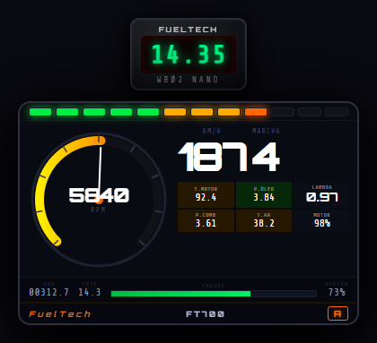
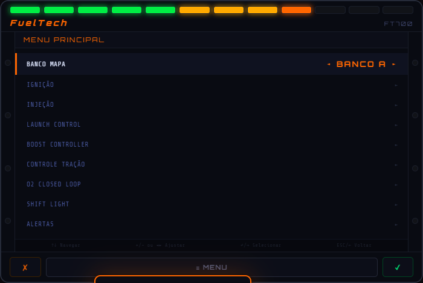
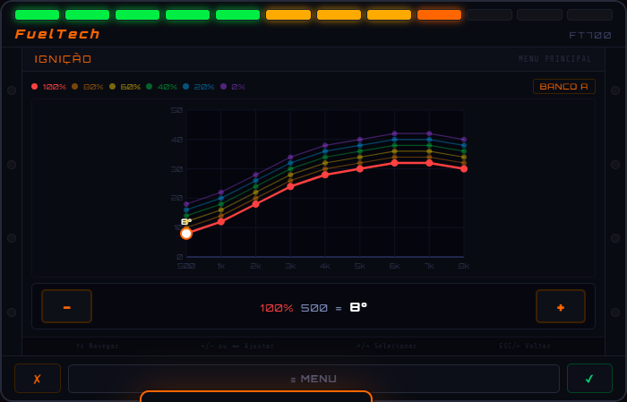
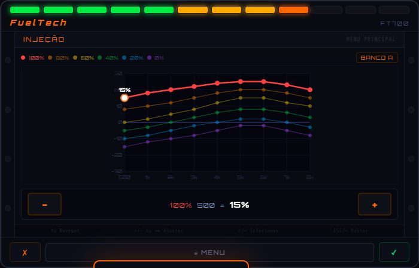
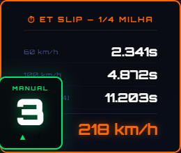

# FuelTech FT700 — GTA RP / QBCore

Velocímetro avançado inspirado na ECU FuelTech FT700, com HUD em tempo real, popup de configuração de mapas de ignição/injeção 3D, launch control, boost controller, controle de tração, câmbio manual, timer de 1/4 milha e muito mais.

---

## Preview

### HUD — Velocímetro em jogo


### ECU Popup (`/ft`) — Menu Principal


### Mapa de Ignição 3D (6×9 — Carga × RPM)


### Mapa de Injeção 3D (6×9 — Carga × RPM)


### Câmbio Manual + Timer de 1/4 milha


---

## Funcionalidades

### HUD (canto inferior direito)
- **12 LEDs RGB** animados por RPM — verde → âmbar → vermelho → branco (shift) → rosa (2-step)
- **Gauge de RPM** canvas redondo com agulha animada
- **KM/H** e **Marcha** em tempo real
- **Grid 2×3 de telemetria:** T.Motor, P.Óleo, Lambda (λ), P.Combustível, T.Ar, Motor%
- **Odômetro + Trip** e barra de combustível
- **WBO2 Nano** — display AFR acima do velocímetro (azul=rica / verde=estequio / vermelho=pobre)
- **Ticker de alertas** com 6 alertas configuráveis
- **Badge do banco ativo** (A / B)

### ECU Popup (`/ft`)
Abre o dispositivo FT700 com LCD de navegação em pilha (stack-based):

| Menu | Função |
|------|--------|
| **BANCO MAPA A/B** | Alterna entre dois bancos de mapas independentes |
| **IGNIÇÃO** | Mapa 3D 6×9 (carga × RPM) com gráfico SVG interativo |
| **INJEÇÃO** | Mapa 3D 6×9 com gráfico SVG interativo |
| **LAUNCH CONTROL** | RPM de 2-step, cut-off na desaceleração, delay |
| **BOOST CONTROLLER** | PSI alvo, RPM de início do boost, Rev Limiter |
| **CONTROLE TRAÇÃO** | % de slip permitido, liga/desliga |
| **O2 CLOSED LOOP** | Ajuste automático do mapa de injeção pelo lambda |
| **SHIFT LIGHT** | RPM para acender shift light (LEDs brancos) |
| **ALERTAS** | 6 alertas configuráveis (detonação, óleo, combustível, injetor) |

### Extras
- `/mt` — **Câmbio Manual** com badge de marcha, setas de up/downshift e redline visual
- **Drag Timer** — Inicia automaticamente no soltar do 2-step; registra 60 km/h, 100 km/h e 1/4 milha (402 m) com trap speed
- **Som de turbo** — spool progressivo + BOV na troca de marcha (requer boost ativo)
- **Fogo no escapamento** — partículas nos tubos de escape no upshift
- **Persistência** — configurações de ECU salvas por jogador × modelo de veículo no banco de dados

---

## Requisitos

| Dependência | Versão mínima |
|-------------|---------------|
| [FiveM](https://fivem.net/) | Build 3095+ recomendado |
| [QBCore Framework](https://github.com/qbcore-framework/qb-core) | Qualquer versão atual |
| [oxmysql](https://github.com/overextended/oxmysql) | Qualquer versão atual |
| MariaDB / MySQL | 10.x+ |

---

## Instalação

### 1. Download do resource

Clone o repositório ou baixe o ZIP e extraia dentro da sua pasta de resources:

```
server-data/
└── resources/
    └── [standalone]/
        └── fueltech_speedometer/   ← pasta do resource
            ├── fxmanifest.lua
            ├── client.lua
            ├── server.lua
            └── html/
```

### 2. Adicionar ao server.cfg

```cfg
ensure fueltech_speedometer
```

> Certifique-se de que `oxmysql` está sendo carregado **antes** deste resource.

### 3. Banco de dados

A tabela `fueltech_ecu` é criada automaticamente na primeira inicialização do resource:

```sql
CREATE TABLE IF NOT EXISTS `fueltech_ecu` (
    `identifier`    VARCHAR(60)  NOT NULL,
    `vehicle_model` VARCHAR(60)  NOT NULL,
    `settings`      LONGTEXT     NOT NULL,
    `updated_at`    TIMESTAMP    DEFAULT CURRENT_TIMESTAMP ON UPDATE CURRENT_TIMESTAMP,
    PRIMARY KEY (`identifier`, `vehicle_model`)
) ENGINE=InnoDB DEFAULT CHARSET=utf8mb4;
```

### 4. Cache do cliente

Após instalar ou atualizar, limpe o cache do cliente FiveM (`%localappdata%\FiveM\FiveM.app\cache`) para garantir que os arquivos NUI sejam recarregados corretamente.

---

## Comandos

| Comando | Descrição |
|---------|-----------|
| `/ft` | Abre o popup da ECU FT700 (apenas dentro de veículos) |
| `/mt` | Ativa/desativa o câmbio manual |
| `PAGEUP` | Subir marcha (câmbio manual) |
| `PAGEDOWN` | Descer marcha (câmbio manual) |

---

## Como usar a ECU

1. Entre em um veículo e pressione `/ft`
2. Use **↑↓** para navegar pelos menus
3. Use **↵ / →** para entrar em um submenu
4. Use **+/−** para ajustar valores
5. Use **ESC / ←** para voltar
6. Os mapas de ignição/injeção têm suporte a **drag do mouse** nos pontos do gráfico
7. Ao fechar (`✗`), as configurações são salvas automaticamente no banco de dados

### Ativar o Launch Control (2-step)

1. Vá em **LAUNCH CONTROL** → ative **2-STEP ATIVO**
2. Configure o **RPM DE CORTE**
3. Em jogo: segure o **freio + acelerador** ao mesmo tempo — o motor fica no RPM limitado
4. Solte o freio para largar — o drag timer inicia automaticamente

### Ativar o Boost Controller

1. Vá em **BOOST CONTROLLER** → configure **BOOST ALVO (PSI)** e **RPM INÍCIO BOOST**
2. Ative **BOOST ATIVO**
3. O turbo irá aumentar potência e velocidade máxima progressivamente a partir do RPM configurado
4. O som de spool e BOV são ativados automaticamente

---

## Estrutura de Arquivos

```
fueltech_speedometer/
├── fxmanifest.lua       — manifest do resource FiveM
├── client.lua           — lógica client-side (Lua): HUD, ECU, física, efeitos
├── server.lua           — lógica server-side (Lua): persistência no banco
└── html/
    ├── index.html       — estrutura do HUD e popup
    ├── style.css        — estilos (tema FuelTech dark)
    ├── script.js        — lógica NUI: menus, gráficos SVG, LEDs, audio
    ├── turbo_spool.ogg  — som de spool do turbo
    └── turbo_bov.ogg    — som de BOV (blow-off valve)
```

---

## Contribuindo

Pull requests são bem-vindos! Para mudanças maiores, abra uma issue primeiro para discutir o que você gostaria de mudar.

### Áreas sugeridas para contribuição
- Suporte a outros frameworks (ESX, standalone)
- Tradução do menu para outros idiomas
- Novos layouts de HUD
- Suporte a múltiplos veículos simultâneos (passageiro)
- Integração com sistemas de mecânico

---

## Licença

[MIT](LICENSE)

---

## Créditos

Desenvolvido para servidores FiveM QBCore. Inspirado no dispositivo real **FuelTech FT700**.
